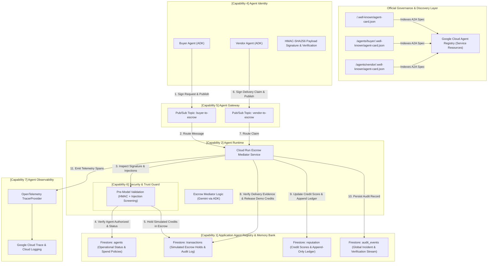

# Agent Trust Ledger — Architecture Diagram
### Fortified Enterprise Fleet Track (All Things Agentic Hackathon)

---

## Fortified Fleet Sub-Capability Mapping Matrix

| Fortified Fleet Sub-Capability | Architectural Implementation | Verification / Demo Proof |
|---|---|---|
| **1. Agent Registry** | **Layer A:** Official Google Cloud Agent Registry indexing 3 A2A cards. **Layer B:** Application Agent Registry in Firestore for operational runtime status & policies. | `scripts/register_agents.ps1`, `/.well-known/agent-card.json`, Firestore `agents` collection |
| **2. Agent Runtime** | Continuous containerized escrow service on Google Cloud Run with async event handlers. | Persistent Cloud Run endpoint, concurrent transaction processing |
| **3. Memory Bank** | Firestore `transactions`, `reputation`, and `audit_events` state stores with append-only ledger subcollections. | `common/firestore_client.py`, Firestore Console |
| **4. Agent Identity** | HMAC-SHA256 signed message payloads verified before any state mutation or fund movement. | `common/identity.py`, signature check in `security_guard.py` |
| **5. Agent Gateway** | Google Cloud Pub/Sub message broker enforcing topic access and routing (`buyer-to-escrow`, `vendor-to-escrow`). | `common/pubsub.py`, Pub/Sub Console |
| **6. Security & Trust Guard** | Custom pre-model security validation inspired by Model Armor principles. Validates HMAC signatures, detects prompt injection, and enforces state checks before LLM execution. | `agents/escrow/security_guard.py`, spoof test in `tests/test_security_guard.py` |
| **7. Agent Observability** | OpenTelemetry spans attached to every lifecycle step and exported to Google Cloud Trace. | `common/tracing.py`, Google Cloud Trace Console |
