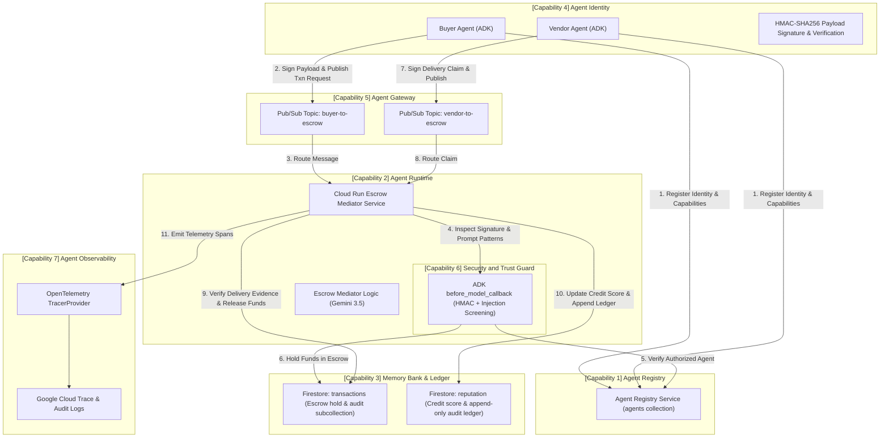

# Agent Trust Ledger — Architecture Diagram
### Fortified Enterprise Fleet Track (All Things Agentic Hackathon)

## Capability Mapping Matrix

| Fortified Fleet Sub-Capability | Architectural Implementation | Verification / Demo Proof |
|---|---|---|
| **1. Agent Registry** | Firestore `agents` collection with status, capabilities, and key metadata | `registry/registry.py`, Step 1 in `scripts/run_demo.py` |
| **2. Agent Runtime** | Continuous serverless container on Cloud Run with async event handlers | Persistent Cloud Run endpoint, concurrent transaction processing |
| **3. Memory Bank** | Firestore `transactions` and `reputation` state stores with append-only ledger subcollections | `common/firestore_client.py`, Firestore console |
| **4. Agent Identity** | HMAC-SHA256 signed message payloads verified before any state mutation | `common/identity.py`, signature check in `security_guard.py` |
| **5. Agent Gateway** | Google Cloud Pub/Sub message broker enforcing topic access and routing | `common/pubsub.py`, Pub/Sub topics |
| **6. Security and Trust Guard** | Custom pre-model security layer (ADK `before_model_callback`) inspired by Model Armor principles. Validates HMAC signatures, detects prompt injection, and enforces state checks before LLM execution | `agents/escrow/security_guard.py`, Step 3 in `run_demo.py` |
| **7. Agent Observability** | OpenTelemetry spans attached to every lifecycle step and exported to Cloud Trace | `common/tracing.py`, Cloud Trace Console URL |
